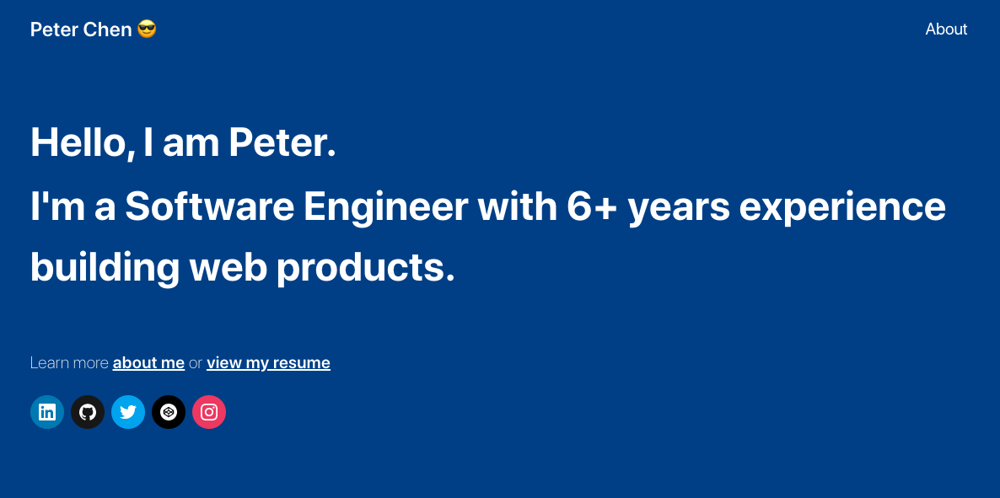
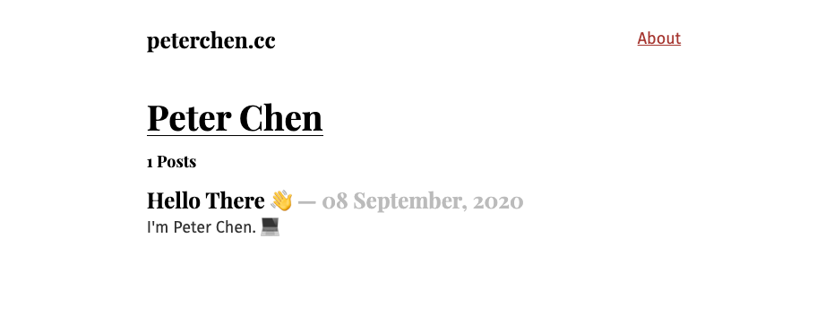

## Finally 😅

I decided to create a place that I can share anything about Web, Tech, and Life. A place that can introduce me to others.

Most importantly, to help myself. Recording some experiences or stories that I might forget in the future and share with others. Or any snippets or notes that can help myself learn again in a quicker time. And I believe writing will help me write better code or documents.

## Why Gatsby?

This are a few reasons:

1. I now prefer work on the front end, so I'm using **JavaScript** very often. And I want more chance to work on it.
2. Writing content with **Markdown** files that can create posts. I don't want to deal with text editor, databases or CMS.
3. I don't really need a site running on web server. And it should be easy to deploy.
4. Site’s speed and performance are importance, for better SEO and experience.

Once I'd decided I want to use JavaScript and Static Site Generator. A modern Jamstack site. There's plenty of them, such as **Gatsby**, **Docusaurus**, **VuePress**. (can find out more in this [list](https://jamstack.org/generators/)).

I choose **Gatsby**. It's very popular (many stars ⭐️) these day, and has a rich ecosystem of plugins and themes. It's a **React** based framework, and using **GraphQL** as main data layer. Since I want to move more focus on front-end. So give **GraphQL** a try.

## Build it up

I just run throw [official tutorial](https://www.gatsbyjs.com/tutorial/) step-by-step. Using [Gatsby's hello-world starter](https://github.com/gatsbyjs/gatsby-starter-hello-world) as template. Follow the steps, add plugins, setup configurations, style components, use GraphQL to query data for pages. And deploy to [Netlify](https://www.netlify.com/).



## Styling in Gatsby

There are many ways to styling in Gatsby. You can add traditional global styles.Or styling around components, use CSS-in-JS like [Emotion](https://emotion.sh/) and [Styled Components](https://styled-components.com/). Or [CSS Modules](https://github.com/css-modules/css-modules).

There are other CSS libraries and frameworks that can use. And after I got to know more about [Tailwind CSS](https://tailwindcss.com/) recently, I found it was amazing. So I choose Tailwind as the CSS framework for this project.

I follow [this guild](https://www.gatsbyjs.com/docs/tailwind-css/) and setup the tailwind in project. Also add an official plugin [Typography](https://tailwindcss.com/docs/typography-plugin) to handle beautiful typographic styling for my parsed Markdown content. It's very simple and easy by adding `prose` classes.

```html
<article className="prose lg:prose-xl">
  <MDXRenderer>{post.body}</MDXRenderer>
</article>
```

Also can customize the style by edit the `theme` section in `tailwind.config.js` file.

```javascript
// tailwind.config.js
module.exports = {
  theme: {
    extend: {
      typography: {
        DEFAULT: {
          css: {
            color: "#333",
            a: {
              color: "#3182ce",
              "&:hover": {
                color: "#2c5282",
              },
            },
          },
        },
      },
    },
  },
  plugins: [require("@tailwindcss/typography")],
}
```

## Conclusion

A few things I really like about Gatsby:

- Completely official tutorial and guides. And It has an extensive open source ecosystem.
- Depend on what kind of direction of your site. There are lots of starter that provide partially built site with some default configuration.
- Hot reloading while developing.
- Image optimization. All of the images are automatically compressed, resized, even handled lazy-loaded in all pages!

It's great that I've started my own blog. I hope i'll put more feature on my site soon, like dark mode, adding components to Markdown with **MDX**, more interactions and cool styles. And others category of contents as well!
