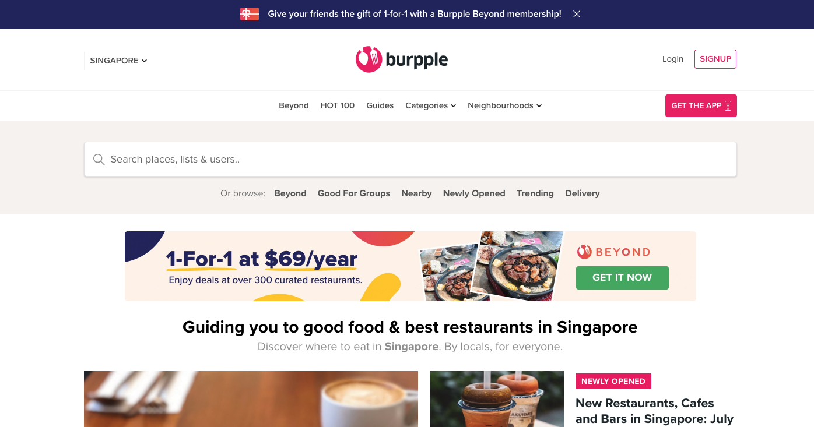
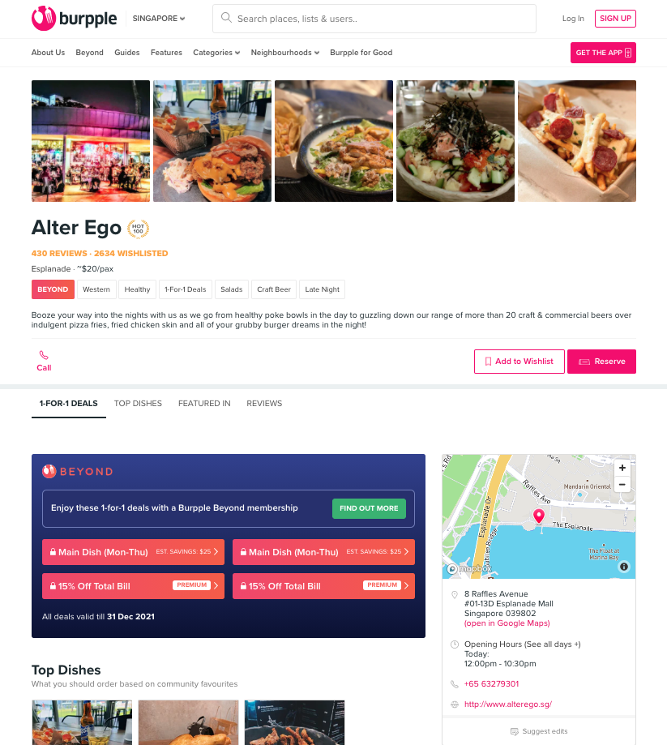
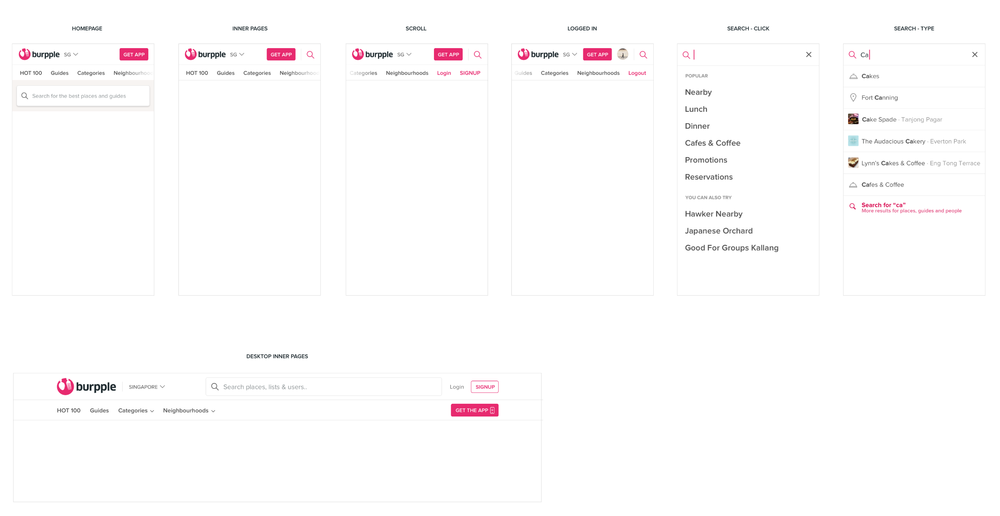
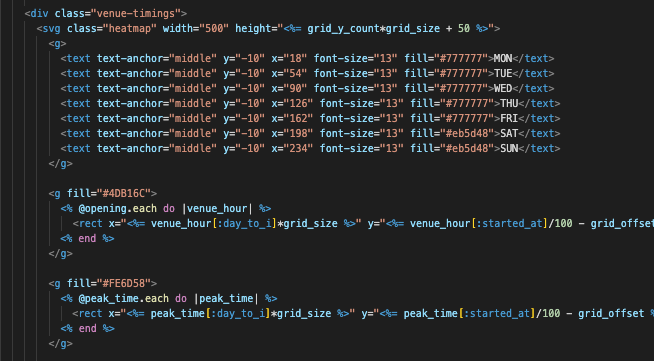
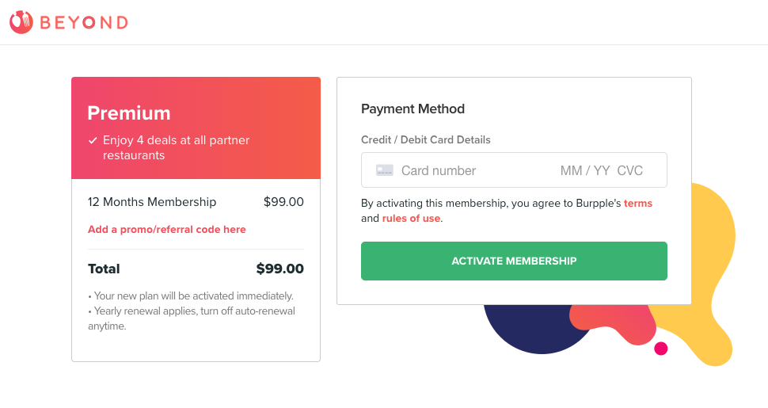
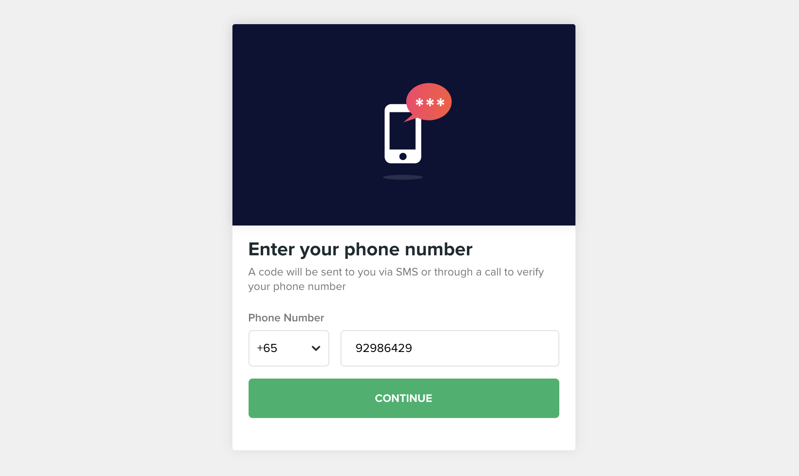
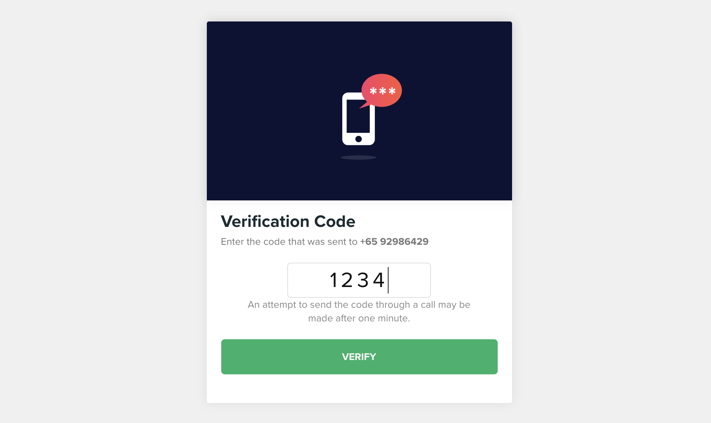

> [Burpple](https://www.burpple.com/) is the leading food reviews platform in Singapore that helps people find the perfect places to eat. In 2018, Burpple launched the Burpple Beyond dining program, where members enjoy 1-for-1 dining deals at over 500 participating merchants.

I joined Burpple's Engineering team in 2018. As a Software Engineer, I took full ownership on web platform and worked closely with design and product teams to launch new features, iterate on core functions to deliver the best user experience.

Our webapp is based on **Ruby on Rails**. No front-end framework, just rendering the html page as default method of Rails.

This article will look back some of my works, as well as some challenges encountered and my thought during development.

## Revamp Venue Page

This is my first major task in Burpple. I worked with the designer very closely, to discuss how the new UI can be implemented. The page has different sections to shows any kind of information relevant to this venue. Such as best dishes, related article, details and food reviews. The new design of this page has different section's layout.



The sticky widgets bar at the bottom and the sticky navigation bar based on scroll position to indicate which link is currently active in the viewport.
The responsive design also need to handle. Different design and interactive in mobile's layout. Such as toggling collapsed venue's detail, horizontal scrolling for venue's images and dish's items, etc.


## Revamp Search Header



## Big New Feature

In 2018, I'm part of the engineering team that built [Burpple Beyond](https://burpple.com/beyond), a subscription-based rewards program that offers 1-for-1 dining deals at over 500 participating merchants.

### Opening Hour's Chart

The program has started with two varieties of membership, members can use their deals during off-peak or anytime.

We have a customer support team to manage the opening hours and the peak hours. The requirement is to have a page to show both working hours and peak hours on the same chart for our user.

I researched and tried on several JavaScript library that can present this kind of chart, like [Chart.js](https://www.chartjs.org/), [D3.js](https://d3js.org/).
While doing the research, I found out those library just rendering SVG out and present graphics by JavaScript. So why not just rendering the SVG elements via Rails in `html.erb` file. I looked into the [SVG elements](https://developer.mozilla.org/en-US/docs/Web/SVG/Element), and using such as `<g>`, `<rect>`, `<pattern>`, with [SVG attributes](https://developer.mozilla.org/en-US/docs/Web/SVG/Attribute) to draw this chart layer by layer.



The working hours of venues are very uncertain, some of the venue only open 4 days a week, or only working on morning, or even 24/7. So have to calculate working timing range before displaying the Y-axis as timings. Firstly drawing grid pattern, and than adding opening hours and peak hours.


It's a tricky way of solving this problem. I learned more about SVG in this task.
You can check the chart here: https://www.burpple.com/alter-ego/timings

### Activation Flow (with Payment and OTP)

We are using [Stripe](https://stripe.com/) as our payment service. I like Stripe very much! Stripe has extremely readable documentations, code samples, and powerful, easy-to-use APIs for developers. They have a great designed dashboard that helps customer manage business settings and related data. You can create products with one-time and recurring prices that are compatible with subscriptions and invoices. Stripe also includes coupon system!

We use Stripe API to get started very quickly, design our customized subscription logic and pricing models. I integrated Stripe payment on web, and focused on front-end tasks such as activation flow, referral program.

Include the [Stripe.js](https://stripe.com/docs/js) script, and do some JavaScript. After the user chooses a plan to start the activation flow. Users add card detail and then activate their membership. We get their payment method and can bill them recurring monthly or annually. Stripe will help us handle payment after that.


In this activation flow, we add a verification process. To verify the user's account via SMS with OTP (one-time password) method.



[Nexmo](https://developer.nexmo.com/) is our OTP Service Provider by integrate [Verify API](https://developer.nexmo.com/verify/overview). And use **Redis** to store the temporary request_id.



## Implement AMP

> [AMP (Accelerated Mobile Pages)](https://amp.dev/) is a web component framework for easily creating user-first websites, stories, ads, emails, and more.

Burpplers share their favorite reviews every day. Our marketing team curates those food reviews into a list or article, as well as partnership collaboration. We have good contents and we want to make more viewer to our website. Most of the content viewer come from google search or other social medial platforms on mobile. So speedup the loading page on mobile browser and improve our website's ranking is the main goal. Instead of refactoring all of the pages to the modern front-end framework, we decide to implement AMP for some key pages.

There are some rules, the AMP HTML documents must:

- Start with the `<!doctype html>` doctype.
- Contain a top-level `<html ⚡>` tag (`<html amp>` is accepted as well).
- ...follow more rules at [here](https://amp.dev/documentation/guides-and-tutorials/start/create/basic_markup/?format=websites#required-mark-up)

In **Ruby on Rails**, create a `application.amp.erb` for layout and copy the page you want to import AMP and change it to `.amp.erb` (such as `app/views/articles/show.amp.erb`)

Add at the end of controller which the imported AMP page belongs to

```ruby
respond_to do |format|
  format.html
  format.amp
end
```

We need to set up `mime_types.rb` file and add

```ruby
Mime::Type.register_alias "text/html", :amp
```

The `` tag are replaced with custom AMP HTML tags

```html
<amp-img src="welcome.jpg" alt="Welcome" height="400" width="800"></amp-img>
```

AMP page can be styled, just add CSS in `<style amp-custom>` tag in the `<head>`

```html
<style amp-custom>
  body {
    background-color: white;
  }
  amp-img {
    background-color: gray;
    border: 1px solid black;
  }
</style>
```

Search from Google in mobile, and open an AMP page (those items with ⚡ icon behind) is super fast!


AMP cannot directly help us improve website's ranking, but its purpose is to indirectly improve your website's ranking, but this indirect can also be achieved through other ways.

---

Continue reading... [part 2](/posts/some-notes-about-what-i-did-in-burpple-part-2).
