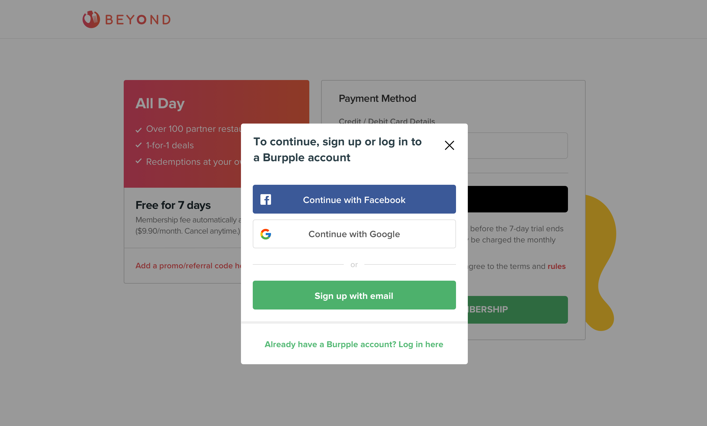

The article continues from [part 2](/posts/some-notes-about-what-i-did-in-burpple-part-2).

## Integrate VueJS into project

We are using the default method of the view rendering in **Ruby on Rails** with some JQuery and JavaScript. We want to rewrite our front-end view to some frameworks like **ReactJS**, **VueJS** or **Angular** to have a fluent experience in the future. But it's a big project that if we want to rewrite all the Rails' views.

So we decided to start things small. Build several small single-page application (SPA) that interacts with the user in the current web page, instead of loading entire new pages.

We choose VueJS

and start to integrate

webpacker

entry point into web page

layout template app/views/layouts/application.html.erb
add javascript_pack_tag and stylesheet_pack_tag

use props to catch Rails's data

### An popup form that can easily let users log in or sign up an account.

It's very important for the user authentication in any activation flow. We want to let new user sign up an account to continue their activate process. So it shouldn't jump to another page to sign up with complicated flow.

It's a popup form

Axios

VueReCaptcha
GSignInButton

### Vuejs app: Suggest edits

[link](https://www.burpple.com/the-beast-1/suggest_edits)

VeeValidate

### Vuejs app: Venue feedback

[venue_feedback demo](https://www.burpple.com/the-beast-1/venue_feedback)
