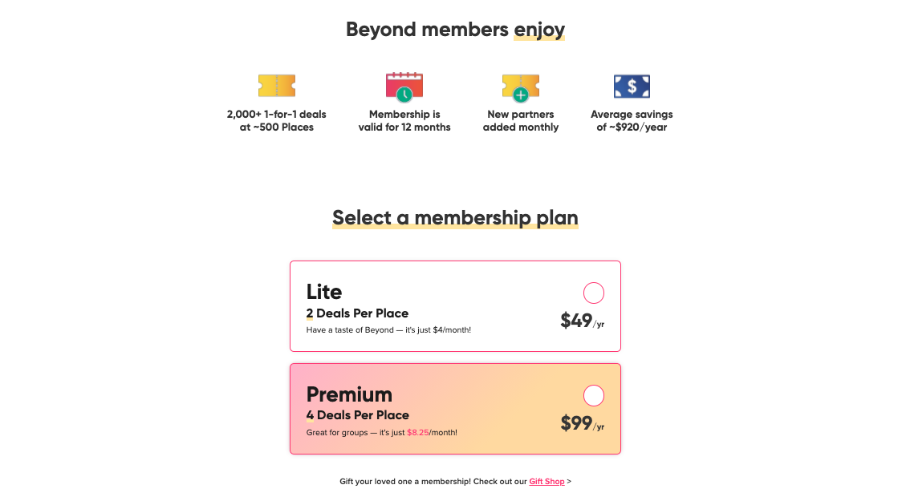
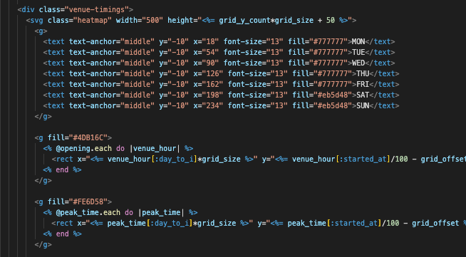
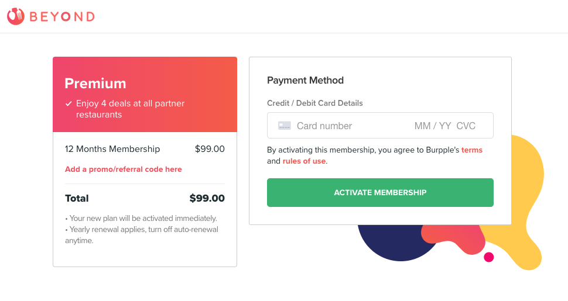
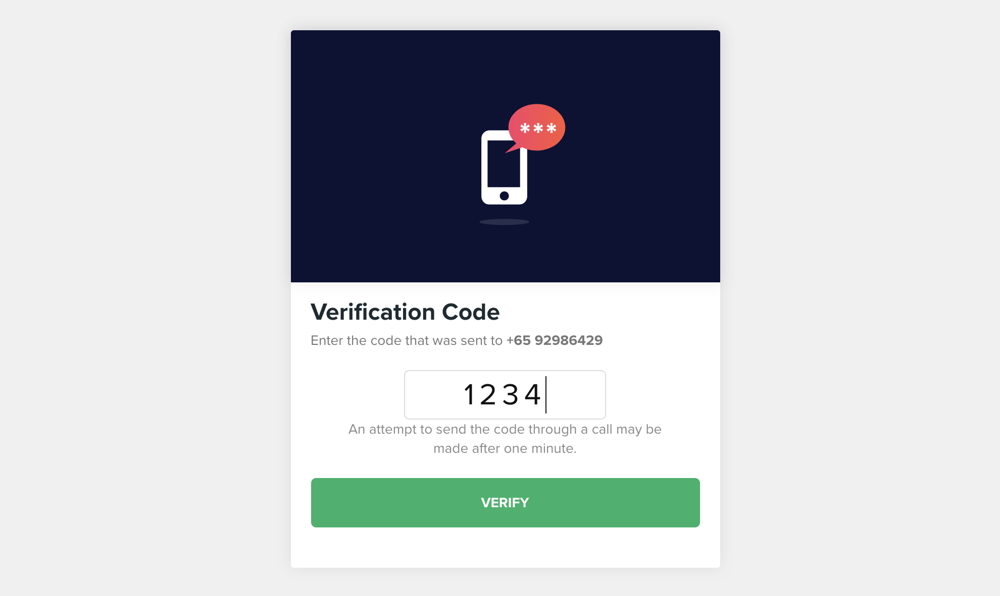

In 2018, I'm part of the engineering team that built [Burpple Beyond](https://burpple.com/beyond), a subscription-based rewards program that offers 1-for-1 dining deals at over 500 participating merchants.

### Opening Hour's Chart

The program has started with two varieties of membership, members can use their deals during off-peak or anytime.

We have a customer support team to manage the opening hours and the peak hours. The requirement is to have a page to show both working hours and peak hours on the same chart for our user.

I researched and tried on several JavaScript library that can present this kind of chart, like [Chart.js](https://www.chartjs.org/), [D3.js](https://d3js.org/).
While doing the research, I found out those library just rendering SVG out and present graphics by JavaScript. So why not just rendering the SVG elements via Rails in `html.erb` file. I looked into the [SVG elements](https://developer.mozilla.org/en-US/docs/Web/SVG/Element), and using such as `<g>`, `<rect>`, `<pattern>`, with [SVG attributes](https://developer.mozilla.org/en-US/docs/Web/SVG/Attribute) to draw this chart layer by layer.

The working hours of venues are very uncertain, some of the venue only open 4 days a week, or only working on morning, or even 24/7. So have to calculate working timing range before displaying the Y-axis as timings. Firstly drawing grid pattern, and than adding opening hours and peak hours.

It's a tricky way of solving this problem. I learned more about SVG in this task.
You can check the chart here: https://www.burpple.com/alter-ego/timings

### Activation Flow (with Payment and OTP)

We are using [Stripe](https://stripe.com/) as our payment service. I like Stripe very much! Stripe has extremely readable documentations, code samples, and powerful, easy-to-use APIs for developers. They have a great designed dashboard that helps customer manage business settings and related data. You can create products with one-time and recurring prices that are compatible with subscriptions and invoices. Stripe also includes coupon system!

We use Stripe API to get started very quickly, design our customized subscription logic and pricing models. I integrated Stripe payment on web, and focused on front-end tasks such as activation flow, referral program.

Include the [Stripe.js](https://stripe.com/docs/js) script, and do some JavaScript. After the user chooses a plan to start the activation flow. Users add card detail and then activate their membership. We get their payment method and can bill them recurring monthly or annually. Stripe will help us handle payment after that.

In this activation flow, we add a verification process. To verify the user's account via SMS with OTP (one-time password) method.

[Nexmo](https://developer.nexmo.com/) is our OTP Service Provider by integrate [Verify API](https://developer.nexmo.com/verify/overview). And use **Redis** to store the temporary request_id.

