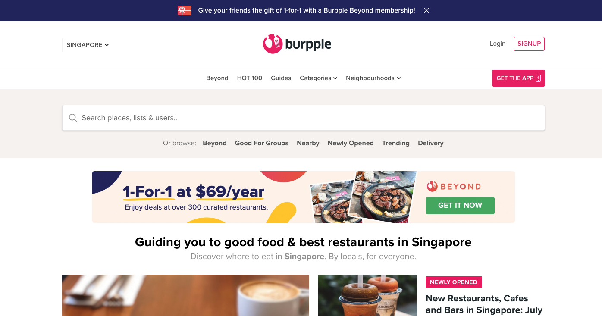
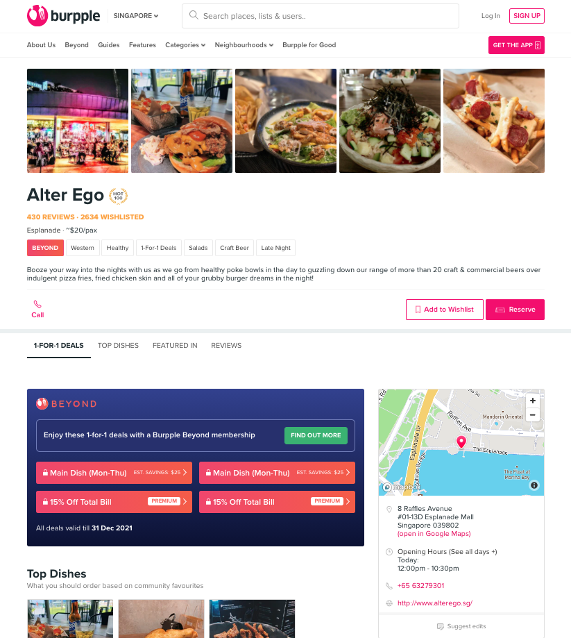
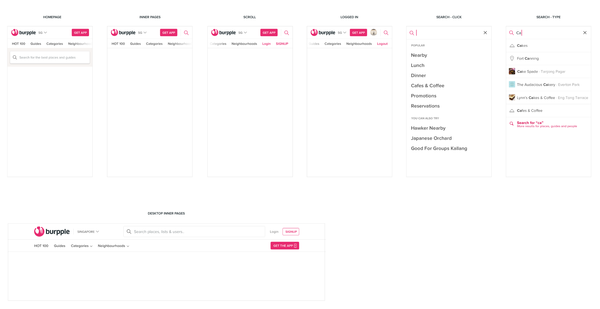

> [Burpple](https://www.burpple.com/) is the leading food reviews platform in Singapore that helps people find the perfect places to eat. In 2018, Burpple launched the Burpple Beyond dining program, where members enjoy 1-for-1 dining deals at over 500 participating merchants.

I joined Burpple's Engineering team in 2018. As a Software Engineer, I took full ownership on web platform and worked closely with design and product teams to launch new features, iterate on core functions to deliver the best user experience.

Our webapp is based on **Ruby on Rails**. No front-end framework, just rendering the html page as default method of Rails.

This article will look back some of my works, as well as some challenges encountered and my thought during development.

### Revamp Venue Page

This is my first major task in Burpple. I worked with the designer very closely, to discuss how the new UI can be implemented. The page has different sections to shows any kind of information relevant to this venue. Such as best dishes, related article, details and food reviews. The new design of this page has different section's layout.

The sticky widgets bar at the bottom and the sticky navigation bar based on scroll position to indicate which link is currently active in the viewport.
The responsive design also need to handle. Different design and interactive in mobile's layout. Such as toggling collapsed venue's detail, horizontal scrolling for venue's images and dish's items, etc.

### Revamp Search Header

