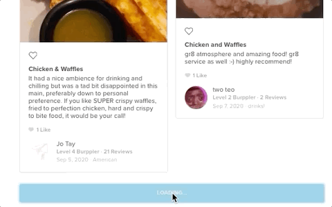

While working on [AMP's task](/posts/use-amp-to-build-great-experiences), I continue to do lots of research on how to optimize website speed!

I took a course about [Website Performance Optimization](https://www.udacity.com/course/website-performance-optimization--ud884) on Udacity. Learned how to optimize website for speed, diving into the details of how mobile and desktop browsers render the pages, such as parsing HTML, **Critical Rendering Path**, render-blocking, etc. And some tips on how to use Chrome’s Developer Tools for debugging and to see the loading timeline. Using [PageSpeed Insights](https://developers.google.com/speed/pagespeed/insights/) (or running [Lighthouse](https://developers.google.com/web/tools/lighthouse) in Chrome DevTools) and [WebPageTest](https://www.webpagetest.org/) to measure the performance data and find out what kind of strategies or opportunities that can be improved in our website.

[Web.dev](https://web.dev/) is a great place to get guidance for the best practice!


After all, I choose to work on three major part:

- Clear the legacy code, remove unused JavaScript, CSS
- Eliminate render-blocking resources
- Images optimization, and lazy-loading

To start with, I run through the project and find unused JavaScript and CSS. The [Coverage tab](https://developers.google.com/web/tools/chrome-devtools/coverage) in Chrome's devtool can help you find unused JavaScript and CSS code.

Secondly, check the HTML in app/view/layouts/application.html.erb. We put lot of `<script>`, `<link>` tags for third party sources and styling stuff. Go with **Lighthouse**'s result and waterfall chart in [WebPageTest](https://www.webpagetest.org/), to identify critical resources. Restructure HTML and then mark the URL tags with `async` or `defer` attributes.


Finally, the images optimization on web. We use **imgix** as our image optimization solution. It's a very powerful image API.

> [imgix](https://www.imgix.com/) transforms, optimizes, and intelligently caches your entire image library for fast websites and apps using simple and robust URL parameters.

You can do resizing, cropping, changing image formats, or even putting text or logo on image, just need to add URL parameters. It also helps you handle the CDN and automated compress the images.


We want to [serve images in next-gen formats](https://web.dev/uses-webp-images/). After do some research about the pros and cons, browser support, and ideal use cases for different types of image format. By **imgix API**, it can automatically convert into a better modern images format (such as WebP) for supported browsers when using `auto=format` parameters.

We also want to [defer offscreen images](https://web.dev/offscreen-images/). Not only delaying the images load, I want to add an Medium-like blur effort. It will make images can be downsized and still retain their space in page's layout to stop content jumping when images load, for better user experience as well!

Each `` tag will have a `data-src` and a `src` attribute. `data-src` is the actual URL for the image. `src` contains very small resolution of the same image. While the page loaded, `src` will fill up the space initially and give the visitor a blurred effect (or LQIP, Low Quality Images Placeholder).

```ruby
# using custom helper for image in html.erb
lazy_load_image_tag(image_url({w: 460}), lqip: image_url({w: 230, fit: 'crop', blur: 200}))
```

In `lazy_load_image_tag` method, we can manage first `src` value and add `lazy-load` class for later JavaScript query select.

```ruby
# image_helper.rb
def lazy_load_image_tag(src, **attrs)
  init_src = attrs.delete(:lqip) || 'data:image/gif;base64,R0lGODlhAQABAAAAACH5BAEKAAEALAAAAAABAAEAAAICTAEAOw=='
  c = "lazy-load #{attrs.delete(:class)}".strip
  tag(:img, src: init_src, 'data-src': src, class: c, **attrs)
end
```

There are three ways to do the lazy loading for off-screen images:

- Using browser-level lazy-loading ([link](https://web.dev/lazy-loading-images/#images-inline-native))
- Using Intersection Observer API ([link](https://web.dev/lazy-loading-images/#images-inline-intersection-observer))
- Using scroll and resize, or orientationchange event handlers ([link](https://web.dev/lazy-loading-images/#images-inline-event-handlers))

Because of the browser compatibility, I choose to use event handlers for lazy loading part.



We also make some changes on `lazy_load_image_tag` method, so that we can add `srcset` attribute to [serve responsive image](https://web.dev/serve-responsive-images/).

Finally, the result are great, we hit the goal and passed lots of audits. And the loading speed become faster.


