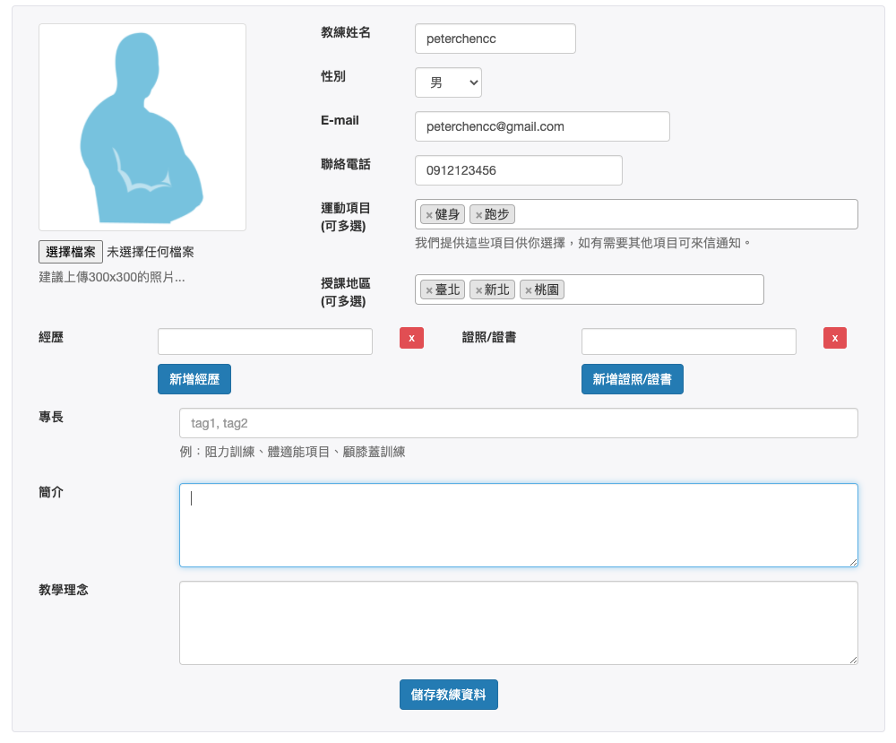

the code here: [https://github.com/peterchencc/fi-coach](https://github.com/peterchencc/fi-coach)

## The Idea

At 2015, I join a 10 weeks Full-time bootcamp at [ALPHA Camp](https://tw.alphacamp.co/). ALPHA Camp is a tech and startup school present in Singapore, Taiwan and Hong Kong. Their mission is to help talents develop future-ready skills, an entrepreneurial mindset, and the professional network to succeed in the digital economy.

This bootcamp divide by three different courses, iOS development, Full-Stack web development, and digital marketing. I attend the Full-Stack web development course. There is professional teachers teaching us how to build a production development skill from scratch, base on Ruby on Rails.

We all pitch some ideas in the first week. And choose what we interested and team up with other course teammates as the bootcamp final project. Experience how to extend your idea and build the product from concept to production ready together. (of course, some of the students really want to start a business and successfully building their startup after this 🥳)

This is the idea that I joined. FiCoach, A platform to improve exercise efficiency and help you find the right sports coach.

## Development

For the engineering of this project. I pair with another iOS engineer. So I need to handle the web platform and provide the API for iOS development.

Base on what we learned during 10 weeks. Using Ruby on Rails with MySQL database and deploy to [Linode](https://www.linode.com/) server.

Some stuff that i use & learn:

- Ruby on Rails 4
- Facebook login and Email users Authentication with [devise](https://github.com/heartcombo/devise) & [omniauth](https://github.com/omniauth/omniauth)
- Setup Linux server with [Nginx](https://www.nginx.com/)
- Deployment tool [Capistrano](https://github.com/capistrano/capistrano)
- Familiar with the [Active Record associations](https://guides.rubyonrails.org/association_basics.html) and relationship databases concept
- [BootStrap](https://getbootstrap.com/) version 3 & JQuery
- Build JSON APIs with jbuilder
- Select2 & nested fields form
- Image upload and file attachment with [paperclip](https://github.com/thoughtbot/paperclip)

To understand the [Model-View-Controller (MVC)](https://en.wikipedia.org/wiki/Model%E2%80%93view%E2%80%93controller) architecture is key to understanding Rails. Building a web platform with Ruby on Rails is much easier. I love the Rails Doctrine _Convention over Configuration_. This can make it very easy for people new to the project to extend it. That's why the startups mostly choose Rails as their framework. And also helps our classmate to review, and learn from others in bootcamp.

## What’s more...

We have a demo day at the end of the bootcamp. Each of us present our works on the stage. And I got a internship opportunity to Singapore after the demo day!
