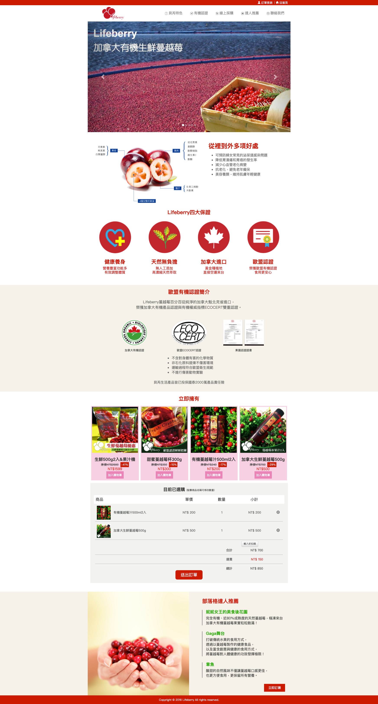
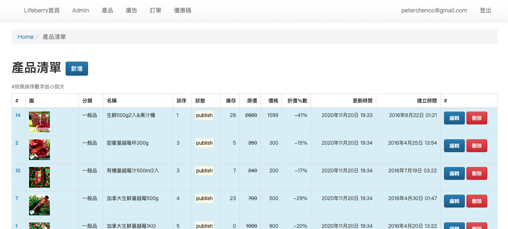
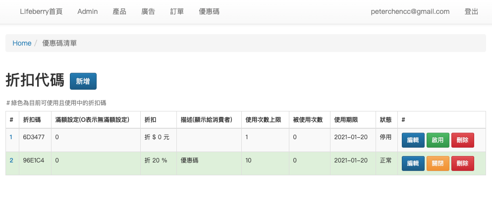

LifeBerryShop is the E-commerce website to sale healthy berry product online.
It's a freelance project in 2015, and updated a few time after that.

## Implementation

This is a single page shopping cart webapp. And the payment gateway integrated with **pay2go** (currently called [ezPay](https://www.ezpay.com.tw/)).

The project built with **Ruby on Rails** and **MySQL**. **Bootstrap** for styling and **JQuery** to handle the frontend interactive. Also setup domain and host the webapp on **Linode** server.

The landing page with a carousel banner for advertisement controlled via admin.

I added [AASM](https://github.com/aasm/aasm) as a state machine to defining states and handle events on models, such as products, orders, coupons.

I choose to use [Active Admin](https://github.com/activeadmin/activeadmin) as administration framework in the first place. It's easy to integrate. But still need some time to catch up if you want to do customization and styling. So I remove it and build the Admin Panel for scratch with Bootstrap styling.

Admin panel can edit products detail, manage statements. Update orders information and with the coupons code system. So my client can do marketing sales.

