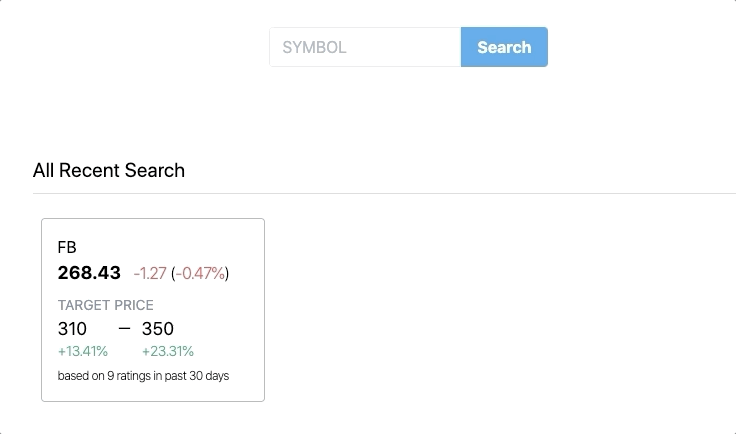
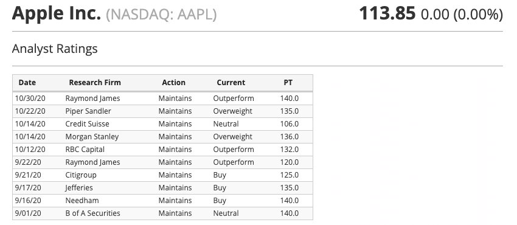
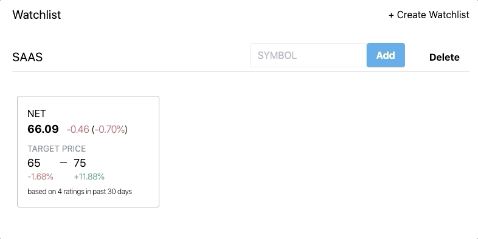
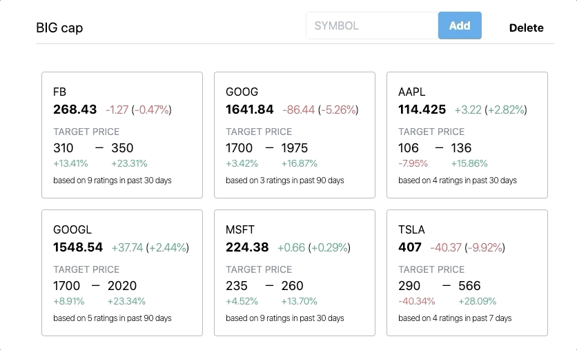

this project hosted on Netlify: [https://target-watch.peterchen.cc/](https://target-watch.peterchen.cc/)

the code here: [https://github.com/peterchencc/target-watch](https://github.com/peterchencc/target-watch)

## The Idea

Target Watch is a web app designed for stock investors to get a snapshot of analyst ratings, price targets, and current prices on their watch lists.

The idea came with me and my wife. We was learning to invest in stock market. We usually take the recommendations from others analyst ratings website before we do the buy/sell actions. Like how many percentage still have between current price and rating price. So we want to have an app to easily help our investment decisions. And manage our watch list to get a quick view to support our decisions.

And also I wanna work on a project build by ReactJS.

## Requirements

- Crawler to get the specific ticker's analyst ratings
- Integrate stock market APIs for current data, and update in real time
- As a logged in user, I want to manage my watchlists
- and more to come, according to our experience...

## Implementation

The webapp initial with [Create React App](https://github.com/facebook/create-react-app). Use [firebase](https://firebase.google.com/) to store the app data and authentication. Firebase offers two cloud-based, client-accessible database solutions that support realtime data syncing. I use **Realtime Database** for the symbol's data which synced states in realtime updates. And **Cloud Firestore** for structured documents and collections, like watchlists and symbol's list.

After doing some research on lots of stock APIs. I choose [Finnhub](https://finnhub.io/) as our stock API. It has Real-Time RESTful APIs and websocket. Simple to use and it's free.

When user search a symbol, we make an API call for current price and crawl the target prices data from analyst' site. Store the stock data in state and sync with **Realtime Database**. And use **localStorage** to store the recent search list locally.

We figure out an algorithm based on rated date and price target, to find out what's the recent target and compare with current price in each stock.

I use [Tailwind CSS](https://tailwindcss.com/) for the interface styling. It's a utility-first CSS framework. I've been using tailwind for the past few months and it's amazing. Never thought building websites could be so fast and flexible.

Logged-in user can create new watchlist and add symbol into it.

Drag and drop interactive, touch-friendly sorting feature to manage your watchlist.

## Another section

This project haven't finished yet, still have lots of bugs.

Final goal of the project was to make the app a easy-viewed website, which will works smoothly during stock trading time. The key to this is to get all the stock price in real-time updated. I should create another server app that can use **Websocket** to make API call for the stock data and sync with firebase's realtime database. So that user could read the real-time data in the client's app.
